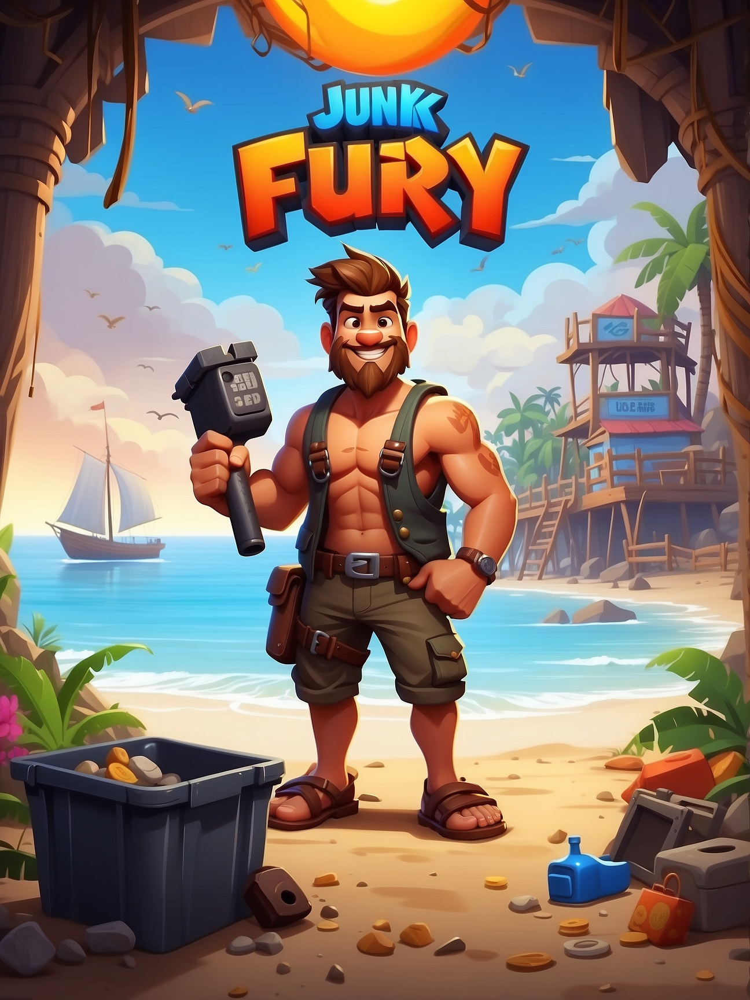
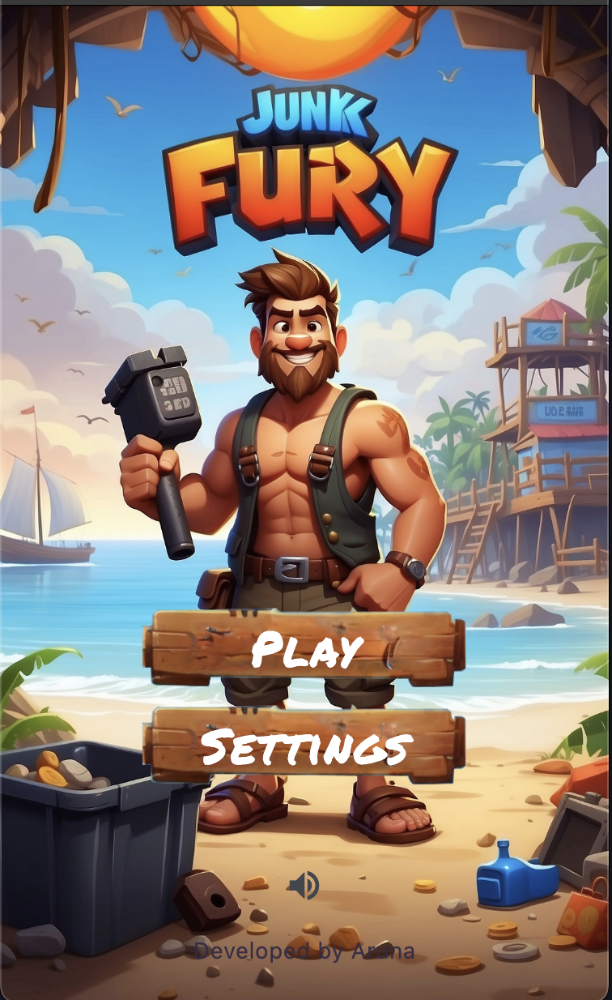
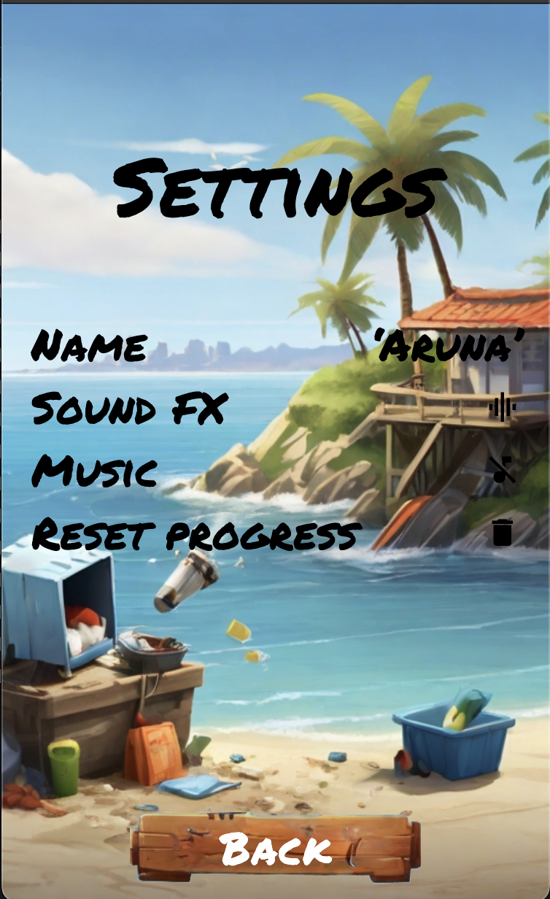
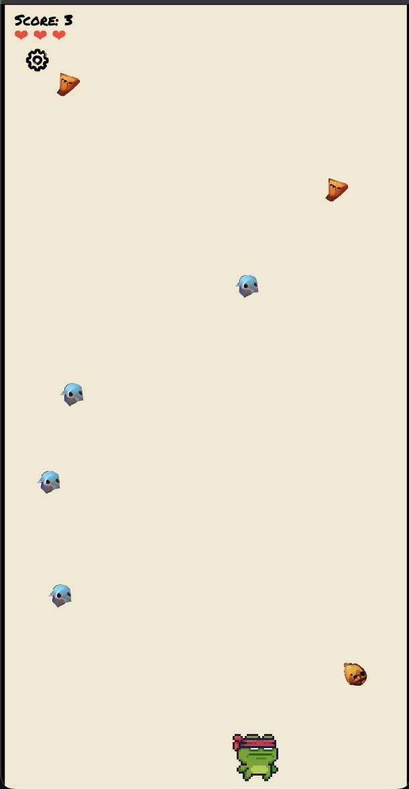

# Junk Fury

Junk Fury is an immersive 2D game designed to raise awareness about the urgent global issue of sea pollution. Players take on the role of a dedicated garbage collector tasked with safeguarding the marine ecosystem by cleaning up debris from beaches and preventing further pollution of the sea.

## Screenshots

    
    
    

## Features

- Engaging gameplay with intuitive controls
- Stunning visuals and immersive underwater environments
- Educational content about the importance of ocean conservation
- Cross-platform support for iOS and Android devices

## Getting Started

To play Junk Fury, follow these steps:

1. Clone this repository to your local machine.
2. Install Flutter and Flame.
3. Run the game on your preferred device.

## Contributing

We welcome contributions from the community! If you'd like to contribute to Junk Fury, please follow these guidelines:

- Fork the repository and create your branch.
- Make your changes and test thoroughly.
- Submit a pull request detailing your changes.

## Feedback

We'd love to hear your feedback on Junk Fury! Feel free to [open an issue](https://github.com/arunanuwantha/junk_fury/issues) if you encounter any bugs or have suggestions for improvements.

